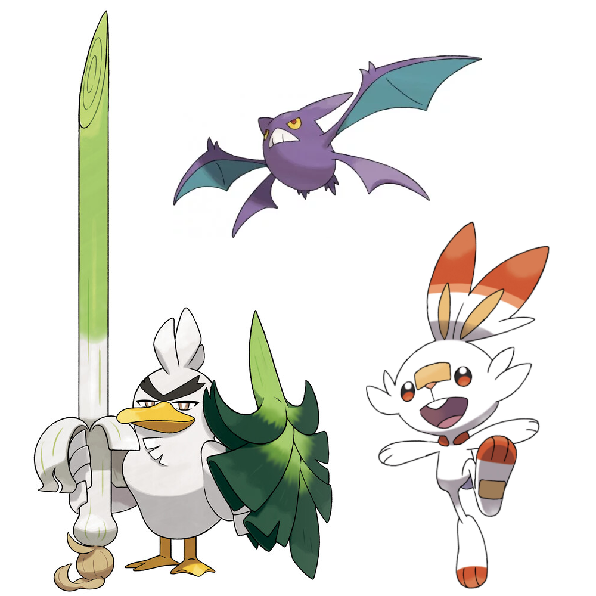
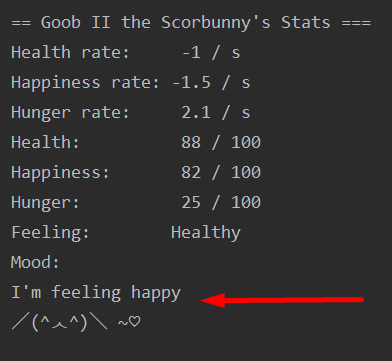
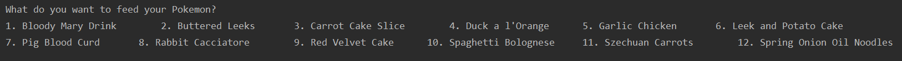

  <h3 align="center">Tamagotchi Simulator with Pokemon Pets</h3>

  <p align="center">
    COMP 3522 Assignment 1 - Tamagotchi Simulator
    <br />


## Getting Started

To get a local copy up and running follow these simple steps.

1. Clone the repo
```sh
git clone https://github.com/amaranth-grain/3522_A01041926.git
```
2. Run in your preferred IDE (e.g. PyCharm).  Game will display in console.  Some characters may not display if you are not on UTF-8.
3. Run **game.py** to begin.


## Usage

Simulate a Tamagotchi by playing with Pokemon pets.

Upon starting the game, a Scorbunny, Crobat, or Sirfetch'd will automatically hatch:




Start game by running in Pycharm or other IDE.  

Game includes the following modules only:

- game.py
- peripherals.py
- pokemon.py


**IMPORTANT NOTE:**

**gameui.py** and **interaction.py** are not part of the game.  I had trouble deleting these after I refactored the code.


## Features

The game fulfills the requirements laid out for Assignment 1.

Some highlighted features:

#### Moods

Pokemon in this game are a bit moody and whimsical.  They're not afraid to tell you how they feel!

View the game on UTF-8 encoding for the best gaming experience.  Moods are randomly pulled from a list specific to each pet (stored in Catalogue).

​                              

#### **Food**

There are many food choices for your pet.

                          

Depending on what you feed your pet, they may entirely refuse to eat it!

Play around to learn what they like.

#### Minigames

1. **Guess that Pokemon!** --
   Type in the name of a starter Pokemon from any generation, and see if you guessed correctly.
2. **Water, Fire, Grass** --
   The Pokemon version of Rock, Paper, Scissors is every bit as fun as the original.
3. **Whack-a-Drilbur** --
   How many Drilburs can you whack?


## Limitations

- Because pet status isn't checked in real time, the game may print alternative results even after a pet has died (it has reached 0 Health)
- "Invalid input. Try again." message only prints if you enter a non-integer.
  If the menu has three choices, and you enter an integer outside of 1, 2, 3, it will print the menu again but will not notify you that it is an invalid input.
- The GameController class directly uses Food and Medicine instead of accepting all Consumables as the behaviour for Food and Medicine is different.  I think that could be implemented better if I had more time.


## Reflection

- I learnt a lot about the Single Responsibility Principle through this assignment.  After a certain point, my game became untenable and difficult to maintain as any changes would require modifications in several places as well as a lot of debugging.
- I had trouble wrapping my mind around polymorphism in a dynamically typed language.  I don't think I understand it completely, but I know it's a lot easier to separate different responsibilities to different classes and have smaller classes than to deal with one that is large and difficult to read.
- Creating a Catalogue class which acts as a database full of items I can draw from (with methods to print out items after they are stored) helped immensely with trimming down unnecessary lines in other classes.
- I looked up whether instance variables in Python should be public or private, and it said that in accordance with the Uniform Access Principle, they recommend making things private unless @property or @x.setter is necessary.  I followed that method as property definitions took up a lot of space and felt like they didn't add a lot when semi-private and private attributes could be modified anyway.


